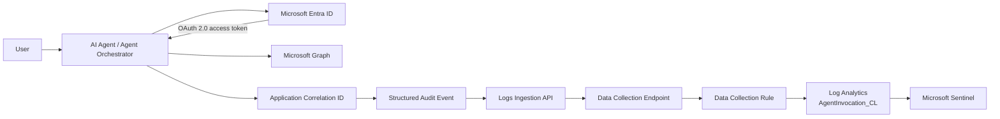

# AI Agent Governance Lab — Entra ID + OAuth 2.0 + Correlation + Azure Monitor + Sentinel

## Executive summary

This project demonstrates an end-to-end enterprise pattern for governing an AI/agent workload:

1. Microsoft Entra ID App Registration provides workload identity.
2. OAuth 2.0 / MSAL obtains an access token.
3. Microsoft Graph is called with least-privilege delegated permission (`User.Read`).
4. Every agent invocation receives an application-level correlation ID.
5. The correlation ID is propagated in `x-correlation-id`.
6. A structured audit event records identity, operation, target, status and result.
7. Azure Monitor Logs Ingestion API sends the event through a Data Collection Endpoint (DCE).
8. A Data Collection Rule (DCR) routes the stream to Log Analytics.
9. `AgentInvocation_CL` stores the telemetry.
10. A negative authorization test records a denied operation.
11. Microsoft Sentinel can detect anomalous/denied agent activity.

> This repository intentionally contains placeholders for tenant IDs, client IDs, DCR IDs and endpoints. Never commit client secrets, access tokens or real audit data.

## Architecture



## Identity model

### App 1 — AI-Agent-Demo

Purpose: agent/user authentication and Graph access.

- Account type: single tenant / organizational directory
- Authentication: public client / interactive desktop flow for the lab
- Graph permission: `User.Read` delegated
- No client secret is required for this public-client lab

For production Azure-hosted workloads, prefer a managed identity or confidential-client pattern appropriate to the workload rather than embedding credentials.

### App 2 — AI-Agent-Log-Ingest

Purpose: server-to-server authorization to Azure Monitor Logs Ingestion.

- No Microsoft Graph permissions are required.
- Assign the minimum Azure role required to write through the DCR.
- Store the client secret outside source code if a secret-based credential is used.

## OAuth 2.0 flow

```text
User
  |
  | sign-in
  v
Microsoft Entra ID
  |
  | access token for Graph
  v
AI Agent
  |
  | Authorization: Bearer <token>
  v
Microsoft Graph /me
```

The token is never written to the audit log.

## Correlation model

There are two useful identifiers:

- **Application correlation ID:** generated by this project for the business transaction, e.g. `AGENT-<UUID>`.
- **Native Entra/Graph diagnostic correlation/request IDs:** retained when returned by the platform/API.

Do not treat these as the same identifier.

The application correlation ID is propagated through the agent transaction:

```text
Agent invocation
      |
      +-- correlationId = AGENT-UUID
      |
      +-- x-correlation-id
      |
      +-- Graph request
      |
      +-- audit event
      |
      +-- Log Analytics
      |
      +-- Sentinel investigation
```

## Repository layout

```text
ai-agent-governance-lab/
├── README.md
├── requirements.txt
├── .gitignore
├── src/
│   ├── agent_test.py
│   ├── negative_test.py
│   └── ingest_logs.py
├── config/
│   └── sample-agent-log.json
├── azure/
│   └── dcr-template.json
├── docs/
│   ├── 01-app-registrations.md
│   ├── 02-oauth-flow.md
│   ├── 03-correlation-and-audit.md
│   ├── 04-log-ingestion.md
│   ├── 05-negative-test.md
│   └── 06-sentinel.md
└── .github/workflows/
    └── security-check.yml
```

## Local setup

```powershell
python -m venv .venv
.\.venv\Scripts\Activate.ps1
pip install -r requirements.txt
```

Set credentials as environment variables. Never commit them:

```powershell
$env:AZURE_TENANT_ID="YOUR_TENANT_ID"
$env:AZURE_CLIENT_ID="YOUR_INGESTION_APP_CLIENT_ID"
$env:AZURE_CLIENT_SECRET="YOUR_SECRET_VALUE"
$env:DCE_ENDPOINT="https://YOUR-DCE.ingest.monitor.azure.com"
$env:DCR_IMMUTABLE_ID="YOUR_DCR_IMMUTABLE_ID"
$env:STREAM_NAME="Custom-AgentInvocation_CL"
```

## Security rules

- Never commit `client_secret`, token caches, access tokens or real audit files.
- Keep Graph permissions at the minimum needed.
- Do not add `User.Read.All`, `Directory.ReadWrite.All`, or broad application permissions without a documented requirement.
- Use managed identity for Azure-hosted production workloads where practical.
- Use PIM for privileged administrative roles.
- Use Conditional Access for human access.
- Restrict network paths according to the production architecture.
- Log authorization failures as well as successful operations.

## Interview statement

> "I designed an Entra ID based identity boundary for an AI agent, implemented OAuth 2.0 with least-privilege Graph permissions, generated an application-level correlation ID for every agent invocation, propagated that ID through downstream requests, and emitted structured audit events. The events were sent through Azure Monitor Logs Ingestion using a DCE and DCR into Log Analytics, where the same correlation ID can be used for investigation and Sentinel detections. I also implemented a negative authorization test to demonstrate that an operation outside the granted permission boundary is denied and logged."

## Current lab evidence

The lab has demonstrated:

- Successful Entra authentication
- Successful Graph `/me` call using `User.Read`
- Custom correlation ID generation
- Local JSONL audit event
- DCE/DCR configuration
- Successful Logs Ingestion API upload
- `AgentInvocation_CL` populated in Log Analytics

The negative authorization test and Sentinel rule are intentionally kept as subsequent stages.
